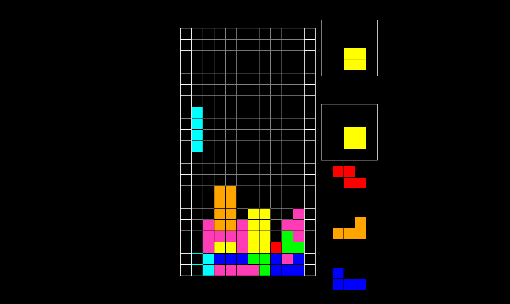

# Table of Contents

- [Building on Windows](#building-on-windows)
- [Building on Linux](#building-on-linux)
- [Running Unit Tests](#running-unit-tests)
- [Running the Game](#running-the-game)
- [License](#license)

# Tetris

A simple game of Tetris implemented using C++ and SDL2. It is designed to be a fun and educational project for myself and others who want to learn
more about game development, C++, and high-level graphics rendering. The game is compatible with both Linux and Windows operating systems, using
CMake for building the project and vcpkg for managing dependencies.



## Controls

**Controls may be configured by editing the `controls.ini` file in the project's root directory.**

The default controls are the following:

* Left Arrow Key -> Move left
* Right Arrow Key -> Move right
* Down Arrow Key -> Move down (soft drop)
* R Key -> Rotate clockwise
* T Key -> Rotate counterclockwise
* S Key -> Hold current Tetromino
* Space Key -> Drop Tetromino

# Building on Windows

## Step 1: Install Dependencies

Before building the project, ensure you have the following dependencies:

* git
* Visual Studio 2019 or later 
    * Even if you don't use the IDE, Visual Studio comes with its own [Developer Terminal](https://learn.microsoft.com/en-us/visualstudio/ide/reference/command-prompt-powershell?view=vs-2022) that make the build process a lot easier.
* vcpkg

After the above dependencies are installed, open up a terminal (Powershell or Command Prompt) and **clone the repository in the current directory**.

```powershell
git clone https://github.com/MichaelB788/Tetris.git
```

## Step 2: Set up vcpkg

**In order for vcpkg to install the rest of the projects dependencies, you need to set an absolute path for vcpkg specific to your machine**.
See [vcpkg in CMake projects](https://learn.microsoft.com/en-us/vcpkg/users/buildsystems/cmake-integration) for more information.

## Step 3a: Build the Project with Visual Studio

Upon opening the Visual Studio IDE, there should be a [configuration dropdown](https://learn.microsoft.com/en-us/visualstudio/debugger/how-to-set-debug-and-release-configurations?view=vs-2022)
with options labeled `vcpkg-debug`, `vcpkg-release`, `default-debug`, and `default-release`.

**If you wish to build the project in *DEBUG* mode, select `default-debug` or `vcpkg-debug`**, recommended for developers and **running unit tests**.

**If you wish to build the project in *RELEASE* mode, select `default-release` or `vcpkg-release`**, recommended if you just want to check the game out.

## Step 3b: Build with Visual Studio's Developer Terminal

Ensure that you are in the root directory of the project. Once there, execute either of these commands

```powershell
cmake -DCMAKE_BUILD_TYPE="Debug" -S . -B build
# OR
cmake -DCMAKE_BUILD_TYPE="Release" -S . -B build
```

# Building on Linux

## Step 1: Install the Dependencies

Ensure you have the following dependencies installed:

* git
* GCC or Clang
* CMake
* SDL2
* SDL2_ttf
* Catch2 (for debugging)

All of these packages can be installed using your distro's package manager.

I've also included a small script under `scripts/` to quickly install these dependencies. Run the
following commands to execute the script.

```bash
chmod +x scripts/install-linux-dependencies.sh
./install-linux-dependencies.sh
```

## Step 2: Building through the Terminal

Ensure that you are in the root directory of the project. Once there, execute either of these commands

```bash
cmake -DCMAKE_BUILD_TYPE="Debug" -S . -B build
# OR
cmake -DCMAKE_BUILD_TYPE="Release" -S . -B build
```

# Running Unit Tests

To run the unit tests, **ensure that you have built the project in debug mode.** After that, you may run
the tests manually after installation using the following command:

```bash
./build/tests/core/core-tests
```

# Running the Game

After building the project, you can run the executable named `Tetris` under `build/src/app/`

# License

This project is open source and distributed under the MIT License.
